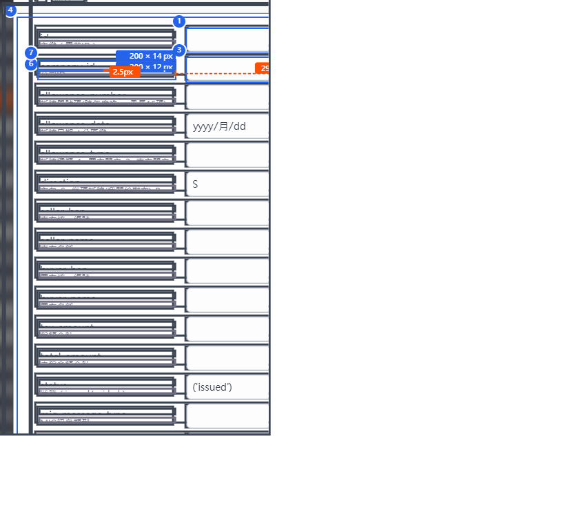
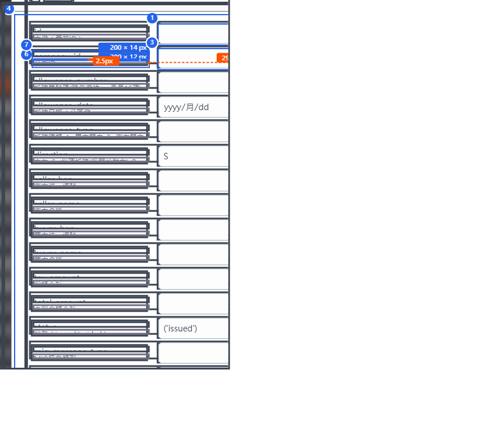

# Frame 1 · input#faker-create_time

## 基本 (Basics)
- **name**: `input#faker-create_time`
- **dom_path**: `input#faker-create_time`
- **position**: (699.33, 642.04) · viewport-relative (40.97%, 67.16%)
- **size**: 180 (寬度) × 32 (高度) px

## 盒模型 (Box Model)
- content: 162.66 × 30.66 px
- padding: 0 / 8 / 0 / 8 (上/右/下/左) (內邊距)
- border: 1 / 1 / 1 / 1 (邊框)
- margin: 0 / 0 / 0 / 0 (外邊距)

## 字體 (Typography)
- font-family: -apple-system, system-ui, BlinkMacSystemFont, "Segoe UI", Roboto, "Helvetica Neue", sans-serif (字體)
- font-size: 14px (字體大小)
- font-weight: 400 (字重)
- line-height: 21px (行高)
- color: rgb(15, 15, 26) (文字顏色)

## 背景 (Background)
- background-color: rgb(255, 255, 255) (背景色)
- border-radius: 6 / 6 / 6 / 6 (圓角)

## 間距 (Gaps)
- **Frame 1 → Frame 2**: 15px horizontal (水平間距)
- **Frame 2 → Frame 3**: 15px horizontal (水平間距)

---

---
frame: 2 of 3
captured_at: 2026-04-24T19:05:17.512Z
viewport: { width: 1707, height: 956, dpr: 1.5 }
scroll: { x: 0, y: 0 }
url: http://localhost:5173/
page_title: 1 • dbo • ding_talk_user
session_id: s-f9tnnu
---

# Frame 2 · span[text="DATETIME (3)"]

## 基本 (Basics)
- **name**: `span[text="DATETIME (3)"]`
- **dom_path**: `html > body > div:nth-of-type(6) > form > fieldset > div:nth-of-type(13) > span`
- **position**: (894.33, 649.04) · viewport-relative (52.39%, 67.89%)
- **size**: 75.45 (寬度) × 18 (高度) px

## 盒模型 (Box Model)
- content: 75.45 × 18 px
- padding: 0 / 0 / 0 / 0 (上/右/下/左) (內邊距)
- border: 0 / 0 / 0 / 0 (邊框)
- margin: 0 / 0 / 0 / 0 (外邊距)

## 字體 (Typography)
- font-family: -apple-system, system-ui, BlinkMacSystemFont, "Segoe UI", Roboto, "Helvetica Neue", sans-serif (字體)
- font-size: 12px (字體大小)
- font-weight: 400 (字重)
- line-height: 18px (行高)
- color: rgb(255, 127, 80) (文字顏色)

## 背景 (Background)
- background-color: rgba(0, 0, 0, 0) (背景色)
- border-radius: 0 / 0 / 0 / 0 (圓角)

---

---
frame: 3 of 3
captured_at: 2026-04-24T19:05:17.512Z
viewport: { width: 1707, height: 956, dpr: 1.5 }
scroll: { x: 0, y: 0 }
url: http://localhost:5173/
page_title: 1 • dbo • ding_talk_user
session_id: s-f9tnnu
---

# Frame 3 · button.peer

## 基本 (Basics)
- **name**: `button.peer`
- **dom_path**: `html > body > div:nth-of-type(6) > form > fieldset > div:nth-of-type(13) > button`
- **position**: (984.78, 648.04) · viewport-relative (57.69%, 67.79%)
- **size**: 20 (寬度) × 20 (高度) px

## 盒模型 (Box Model)
- content: 18.66 × 18.66 px
- padding: 0 / 0 / 0 / 0 (上/右/下/左) (內邊距)
- border: 1 / 1 / 1 / 1 (邊框)
- margin: 0 / 0 / 0 / 0 (外邊距)

## 字體 (Typography)
- font-family: -apple-system, system-ui, BlinkMacSystemFont, "Segoe UI", Roboto, "Helvetica Neue", sans-serif (字體)
- font-size: 14px (字體大小)
- font-weight: 400 (字重)
- line-height: 21px (行高)
- color: rgb(255, 255, 255) (文字顏色)

## 背景 (Background)
- background-color: rgb(255, 80, 0) (背景色)
- border-radius: 4 / 4 / 4 / 4 (圓角)
