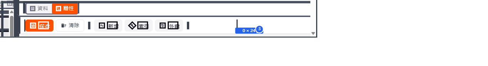

# Frame 1 · div.ops-btns

## 基本 (Basics)
- **name**: `div.ops-btns`
- **dom_path**: `div#main-content > div:nth-of-type(1) > div:nth-of-type(1) > div:nth-of-type(2) > div > div > div:nth-of-type(3) > div:nth-of-type(2) > div > div > div:nth-of-type(2) > div:nth-of-type(1) > div:nth-of-type(12) > div`
- **position**: (1345.35, 160.67) · viewport-relative (78.81%, 16.81%)
- **size**: 108 (寬度) × 24 (高度) px

## 盒模型 (Box Model)
- content: 108 × 24 px
- padding: 0 / 0 / 0 / 0 (上/右/下/左) (內邊距)
- border: 0 / 0 / 0 / 0 (邊框)
- margin: 0 / 0 / 0 / 0 (外邊距)

## 字體 (Typography)
- font-family: -apple-system, system-ui, BlinkMacSystemFont, "Segoe UI", Roboto, "Helvetica Neue", sans-serif (字體)
- font-size: 14px (字體大小)
- font-weight: 400 (字重)
- line-height: 21px (行高)
- color: rgb(59, 67, 81) (文字顏色)

## 背景 (Background)
- background-color: rgba(0, 0, 0, 0) (背景色)
- border-radius: 0 / 0 / 0 / 0 (圓角)
